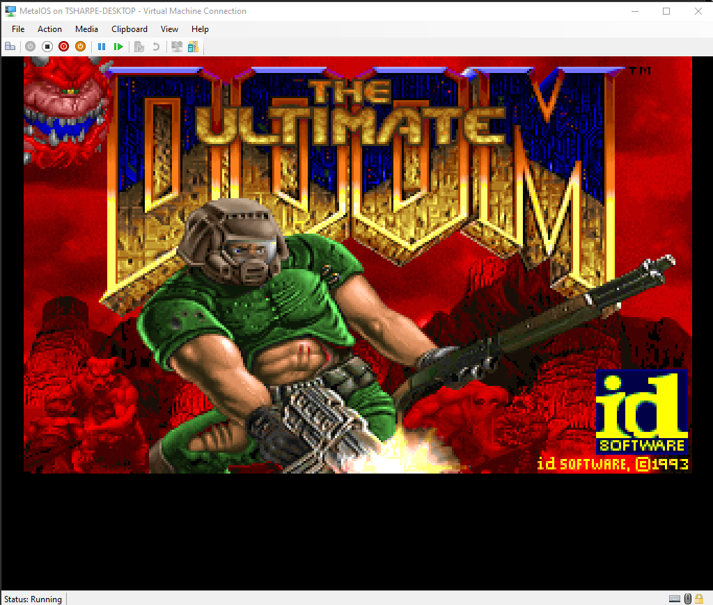

# MetalOS

## Introduction
MetalOS is homebrew operating system for x86-64. It is 64-bit only and has only been tested in Hyper-V Gen2.

### Project Goals
* Run DOOM!
* 48-bit canonical virtual address space (not identity paging)
  * Low half used for Usermode
  * High half used for Kernel mode
* Ring 0 (Kernel) and Ring 3 (User)
* Modern systemcall interface (syscall instruction)

### Non-Goals
* 32-bit compatibility
* Support for bios

## Architecture
MetalOS is a monolithic kernel that uses a custom UEFI bootloader:

### Kernel
Todo

### Bootloader
Todo

## Usermode Interface
Usermode interface is provided by MetalOS.h and a single runtime dll.

### Features
* Kernel Call Stack (virtual unwind + PDB support)

    IP: 0xffff8000010122c6 Function: ?Bugcheck@Kernel@@QEAAXPEBD00@Z Line: 395  
    IP: 0xffff800001017b3c Function: ?SetScreenBuffer@Kernel@@QEAA?AW4SystemCallResult@@PEAX@Z Line: 173  
    IP: 0xffff800001015383 Function: ?Syscall@Kernel@@QEAA_KPEAUSystemcallFrame@@@Z Line: 899  
    IP: 0xffff80000102e87f Function: SYSTEMCALL_HANDLER Line: 56  
    IP: 0xffff800001039c9c Function: x64_SYSTEMCALL Line: 50  

### 3rd Party code
* ACPCIA
* Virtual Stack Unwinder from coreclr
* kvprintf

### Hyper-V Notes
Gen2 Hyper-V was chosen early into development for its 64-bit UEFI environment (versus the real mode bios booting of Gen1). Gen1 VMs use emulated legacy hardware which allows it to run most operating systems without any modification. However, Gen2 VMs use all synthetic hardware, which requires using the VMBus for access, an entirely undocumented protocol. Drivers used in MetalOS relied heavily on looking at linux driver source (drivers that were written by Microsoft).

- [x] VMBus
- [x] Keyboard
- [ ] Mouse (50%)
- [ ] Video Adapter
- [ ] SCSI
- [ ] Network

## Screenshots

## Doom

